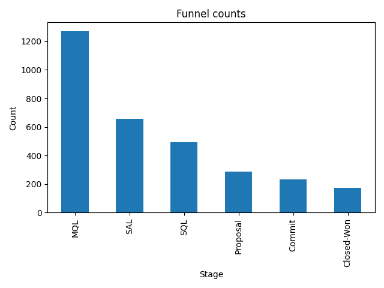
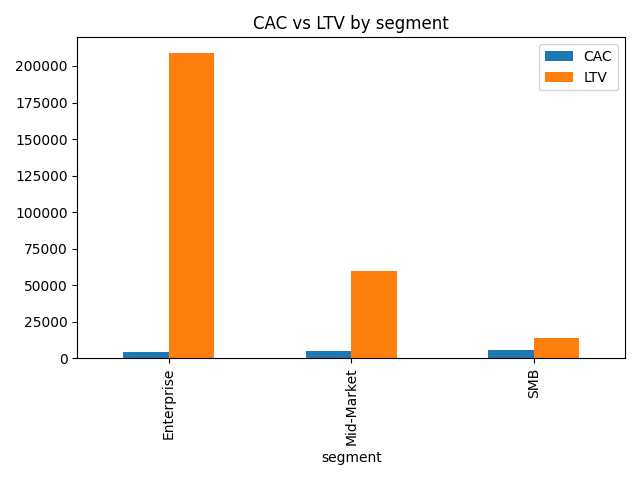
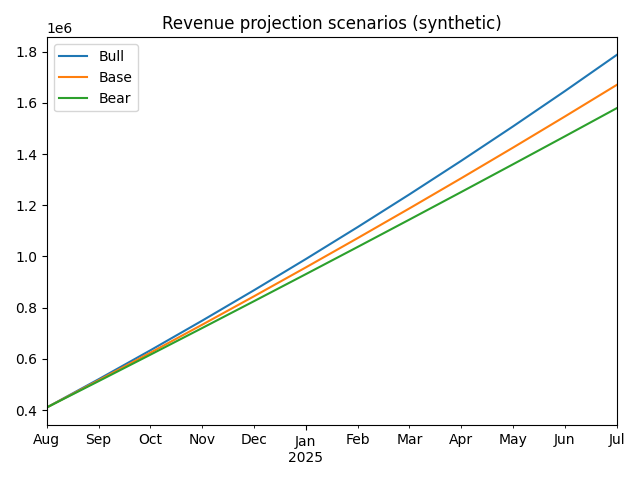

# revops-strategy-flagship (synthetic)

[https://afolabisabur.github.io/revops-strategy-flagship/](https://afolabisabur.github.io/revops-strategy-flagship/)

[](LICENSE)
[](../../releases)
[](https://afolabisabur.github.io/revops-strategy-flagship/)

**Downloads:** see the latest [Release](../../releases) or direct ZIP:  
https://github.com/AfolabiSabur/revops-strategy-flagship/releases/latest/download/strategy_flagship_pack.zip


End-to-end **Revenue Operations (RevOps)** + **Corporate Development (Corp Dev)** demo:
data → metrics → scenarios → M&A → portfolio → **one-page HTML report**.

All data is synthetic. Assumptions live in `config.yaml`.

## Quick start

```bash
python run.py
# Windows users can double-click run.bat
```

<details><summary>Run order (for transparency)</summary>

```bash
pip install -r requirements.txt
python src/generate_data.py
python src/build_charts.py
python src/scenario_planner.py
python src/deal_model.py
python src/portfolio_optimizer.py
python src/compute_kpis.py
python src/build_sparklines.py
python src/build_report.py
python src/build_zip.py
```

</details>

## Screenshots

<p>
  
  
</p>
<p>
  
</p>

## Bring your own CSV

You can run the full pipeline on your own dataset in two ways.

### Option A — Your headers already match the schema

Place your file at:

```
data/revops_synthetic.csv
```

Then run:

```bash
python run.py
```

### Option B — Your headers differ (use the mapper once)

1. Create a header map CSV (see `docs/column_map.csv` template).
2. Produce a canonical file, then run:

```bash
python src/adapters/example_mapper.py --in path/to/your.csv --map docs/column_map.csv --out data/revops_synthetic.csv
python run.py
```

### Canonical schema (required columns)

`date, account_id, segment, region, industry, product, channel, spend, impressions, clicks, leads, stage, opportunity_value, rep_id, cycle_days, status, renewal_flag, expansion_value`

* `date` = YYYY-MM-DD
* `segment` ∈ {SMB, Mid-Market, Enterprise}
* `region` ∈ {NA, EMEA, APAC, LATAM}
* `channel` ∈ {paid_search, paid_social, events, outbound, referral, partner}
* `stage` ∈ {MQL, SAL, SQL, Proposal, Commit, Closed-Won, Closed-Lost}
* numerics ≥ 0; `renewal_flag` ∈ {0,1}

See **`docs/DATA_SCHEMA.md`** for a table and examples.
